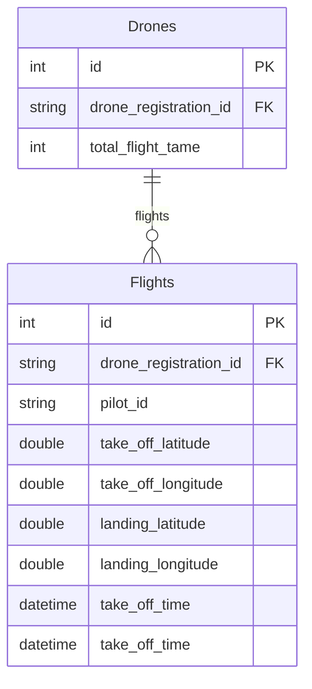

## 技術スタック

フレームワーク：Ruby on Rails 7.1

データベース：MySQL 8.0

テスト：Rspec

その他：Docker

## データベース ER図

## ローカル環境起動手順

1.リポジトリをローカルにClone
  
	git clone https://github.com/csweetj/DroneAPI.git

2.ルートディレクトリーに移動し、ルートディレクトリに.envファイルを作成
  
	cd DroneAPI

 	touch .env

3.依存関係のインストール
	
 	docker-compose run web bundle install

4.envファイルの中身に下記を記載
 
 >	MYSQL_PASSWORD = "1234abcd"
 >	
 >	MYSQL_DATABASE = "drone_api_production"
 >	
 >	MYSQL_USER = "user"
 >
 >	BASIC_AUTH_USERNAME="user"
 >
 >	BASIC_AUTH_PASSWORD="1234abcd"

5.データベースを作成する

   	docker-compose run web rails db:create
	

6.dockerコンテナをビルド、実行
  
	docker-compose up -d

7.稼働中のコンテナに入り、DBをマイグレーション
  
	docker exec -it droneapi-web-1 bash
  
	rails db:migrate RAILS_ENV=development

8.http://localhost:3000/ にアクセス

## APIお試し

・飛行記録の取得
	
 	curl -X GET "http://localhost:3000/flights?drone_registration_id=JUXXXXXXXXXXX" -u user:1234abcd

・飛行記録の登録
	
 	curl -X POST "http://localhost:3000/flights" -u user:1234abcd -H "Content-Type: application/json" -d '
	[
	    {
	      "droneRegistrationId": "JU1XXXXXXXXXX",
	      "pilotId": "PLXXXXXXXXXXX",
	      "takeOffLatitude": "35.787671",
	      "takeOffLongitude": "137.797908",
	      "landingLatitude": "35.787671",
	      "landingLongitude": "137.797908",
	      "takeOffTime": "2023-01-01T00:00:00Z",
	      "landingTime": "2023-01-01T01:00:00Z"
	    },
     	    {
	      "droneRegistrationId": "JU2XXXXXXXXXX",
	      "pilotId": "PLXXXXXXXXXXX",
	      "takeOffLatitude": "85.787671",
	      "takeOffLongitude": "157.797908",
	      "landingLatitude": "25.787671",
	      "landingLongitude": "177.797908",
	      "takeOffTime": "2024-01-01T00:00:00Z",
	      "landingTime": "2024-01-01T02:00:00Z"
	    }
	  ]'

## お試し後
起動中のコンテナを落とし、不要になったdocker image、docker volumeを削除
	
 	docker-compose down
	docker rmi droneapi-web-1
 	docker volume rm droneapi_db-data
